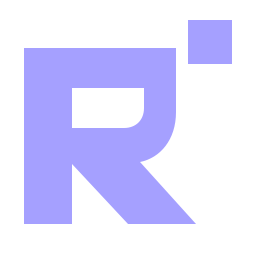
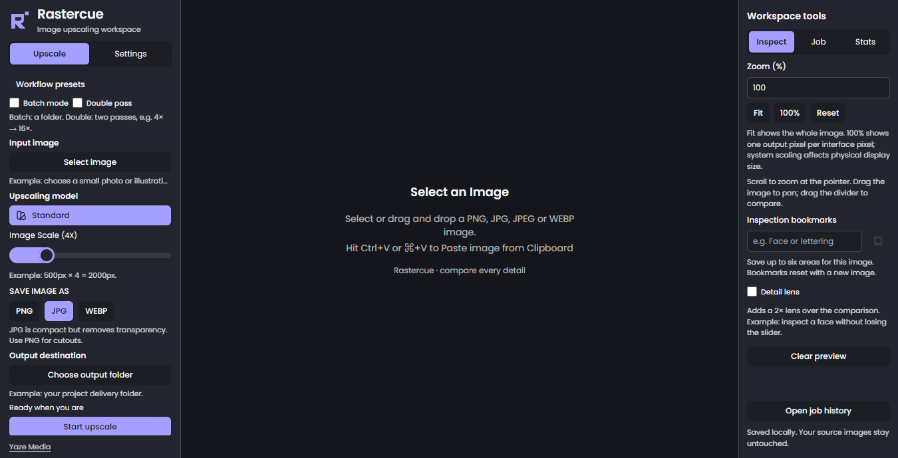

<p align="center"></p>

# Rastercue

**A local image-upscaling workspace for designers, by [Yaze Media](https://github.com/YazeKT).**

[Download Windows beta](https://github.com/YazeKT/Rastercue/releases/tag/v1.0.0-beta.1) · [User guide](docs/USER-GUIDE.md) · [Changelog](CHANGELOG.md) · [Licences and credits](THIRD-PARTY-NOTICES.md)

[](https://github.com/YazeKT/Rastercue/actions/workflows/ci.yml)

Rastercue is an independently branded, UI-focused derivative of [Upscayl](https://github.com/upscayl/upscayl). It preserves the established native upscaling foundation while adding clearer controls, detailed model guidance, image inspection and persistent job records.



## What changed

- Permanent compact left/right panels; smaller-height workflow pages and paginated settings.
- Dark-first Rastercue identity, flat SVG logo and platform icons.
- Enlarged searchable model browser, usage/avoidance guidance, provenance and honest licence warnings; favourites and named presets.
- Persistent before/after slider, synchronised pan/zoom, numeric zoom, Fit/100%/Reset, session bookmarks and optional lens.
- Current-job measurements, safe output naming, persistent searchable local history and thumbnails.
- Readable, expandable logs with severity filters, search, copy and local export.
- JPG fresh-install default, transparency confirmation and a narrow alpha-to-JPG compatibility safeguard.
- Separate application data; no analytics, cloud promotions or online log upload.

Single, batch, double-pass, cancellation, supported formats, metadata/compression controls and aggregate statistics are inherited capabilities—not newly invented Rastercue engines. Native binaries, model IDs and protected processing code remain baseline-identical. The JPEG safeguard changes only temporary alpha-containing inputs for JPG export; originals remain untouched.

## Current status

**Windows x64 beta for designer testing.** The release provides an NSIS `.exe` installer and ZIP distribution. It is unsigned: Windows may show SmartScreen warnings, and no verified publisher identity is claimed. macOS/Linux runtime, signing/notarisation, clean-machine acceptance and hosted older-version updater installation remain unverified. New interface guidance is English; inherited language/theme choices remain. See [evidence and remaining work](docs/IMPLEMENTATION-STATUS.md).

The intended RX 580 / i5-8600K / 32 GB work PC is not yet tested. The development laptop has intermittent Vulkan memory-allocation failures, including the final hardware-accelerated processing smoke. This release is explicitly for work-PC evaluation, not production acceptance. Follow the [work-PC comparison checklist](docs/WORK-PC-TEST.md).

The release security pass disables renderer Node integration, enables isolation/web security and restricts navigation/IPC. Full and production npm audits reported zero known advisories on 18 September 2026; this is not an independent security audit. The preload is not fully sandboxed. Read [SECURITY.md](SECURITY.md), use trusted inputs and retain the remaining release gates.

Windows packages include the unchanged engine and verified Standard/Digital Art models. The release also offers a separately credited custom pack: anime video x2/x3/x4 and Nomos8kSC. Other model weights are excluded because their exact rights/identity remain unverified. The model browser labels unavailable models, and missing presets never silently substitute. See [file-level rights evidence](docs/MODEL-REDISTRIBUTION.md).

Requires Windows x64, a Vulkan-capable GPU/driver, and the [Microsoft Visual C++ x64 Redistributable](https://learn.microsoft.com/en-us/cpp/windows/latest-supported-vc-redist) installed directly from Microsoft. No Microsoft runtime DLLs are bundled. ZIP users must extract the **whole folder**, not just the executable. Source and binary artifacts are separate; no weights/installers are committed to Git. No model downloads occur inside the app.

## Develop locally

Prerequisites: Git, Node.js 22 LTS and npm; a Vulkan-capable GPU supported by the inherited engine. Native packaging must be tested on each target OS.

```sh
git clone https://github.com/YazeKT/Rastercue.git
cd Rastercue
npm ci
# Read LEGAL.md and the upstream/creator model terms first.
npm run assets:fetch -- --acknowledge-model-terms
npm run build
npm run test:rastercue
npm run test:history
npm start
```

The fetch command obtains only the existing baseline upstream assets from a pinned Upscayl commit, verifies SHA-256 and refuses to overwrite mismatched local assets. It is a developer setup command, not an in-app download feature. Existing valid local assets require no network. See [development details](docs/DEVELOPMENT.md).

## Use the workspace

Select an image/folder, model, scale, format and destination before starting. Use PNG for transparent artwork. JPG cannot retain alpha; continuing JPG places transparent areas on white in a temporary RGB input. Open Job for output naming and measured sizes; use History for previous records. Zoom and pan affect viewing only, never exported pixels. Model guidance is test-first advice, not guaranteed restoration of faces, text or logos.

See [user guide](docs/USER-GUIDE.md), [model rights/guidance](docs/MODELS.md), [changelog](CHANGELOG.md), [privacy](PRIVACY.md), [security](SECURITY.md) and [release gates](docs/RELEASE-CHECKLIST.md).

## Licensing and attribution

The application retains its upstream [GNU AGPL v3 licence](LICENSE). Rastercue modifications are by Yaze Media / YazeKT (2026). Upscayl was created by Nayam Amarshe, TGS963 and its contributors. **Upscayl-NCNN is also AGPL-3.0; Real-ESRGAN's BSD notice is a separate component notice.** Fonts, native runtime dependencies and individual model weights have separate terms. The AGPL does not blanket-license every model or asset. Read [NOTICE](NOTICE.md), [legal/provenance boundaries](LEGAL.md) and [third-party notices](THIRD-PARTY-NOTICES.md).

Corresponding application source is this repository/tag. Complete corresponding Windows engine source, including pinned recursive submodules and original build scripts, accompanies the release; see [engine provenance](docs/ENGINE-PROVENANCE.md). Full notices are included in packages and custom packs. Brand/name availability is not trademark-cleared. No warranty of model accuracy or paid-work suitability is given.

## Contribute or report an issue

Read [CONTRIBUTING](CONTRIBUTING.md). Report Rastercue issues here rather than sending fork-specific bugs upstream. Remove private filenames, paths and images before sharing diagnostics. Security issues should not include exploit details or secrets in a public issue; see [SECURITY](SECURITY.md).
