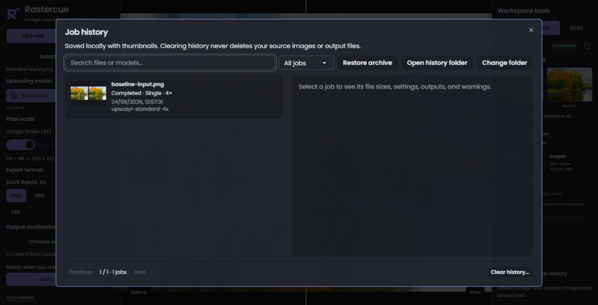
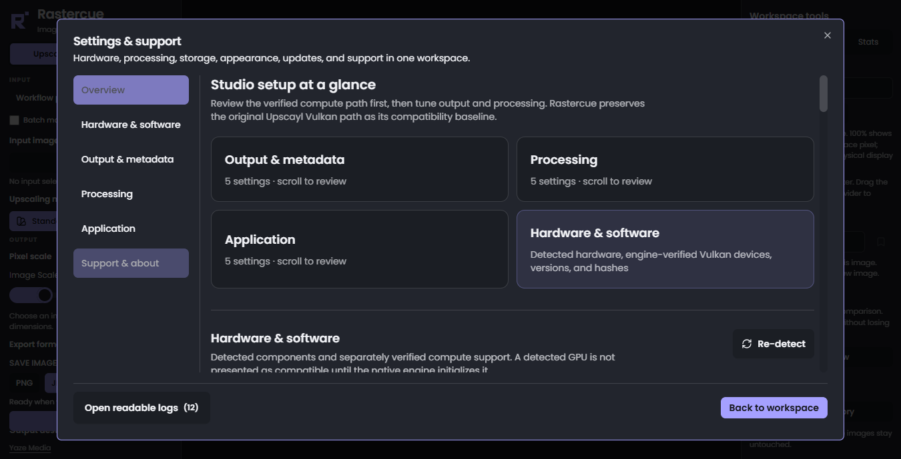
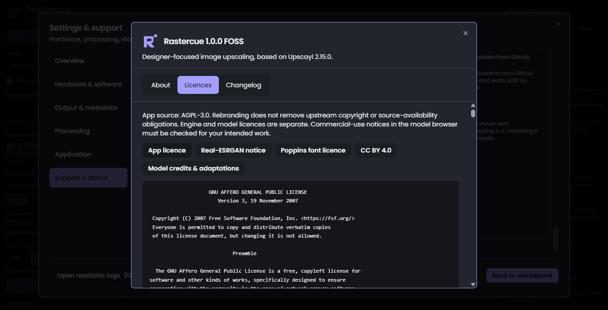

<p align="center"></p>

# Rastercue

**A local image-upscaling workspace for designers, by [Yaze Media](https://github.com/YazeKT).**

[Download Rastercue 1.0](https://github.com/YazeKT/Rastercue/releases/latest) · [Documentation](docs/README.md) · [Hardware guide](docs/HARDWARE-GUIDE.md) · [Changelog](CHANGELOG.md) · [Support](SUPPORT.md)

[](https://github.com/YazeKT/Rastercue/actions/workflows/ci.yml)

Rastercue is an independently branded, UI-focused derivative of [Upscayl](https://github.com/upscayl/upscayl). It preserves the established native upscaling foundation while adding clearer controls, detailed model guidance, image inspection and persistent job records.


<p align="center">
  
  
  
</p>

## What changed

- Permanent compact left/right panels; one scrollable Input/Model/Output workflow and a full Settings popup without arrow pagination.
- Dark-first Rastercue identity, flat SVG logo and platform icons.
- Enlarged searchable model browser, usage/avoidance guidance, provenance and honest licence warnings; favourites and named presets.
- Persistent before/after slider, synchronised pan/zoom, numeric zoom, Fit/100%/Reset, session bookmarks and optional lens.
- Current-job measurements, safe output naming, persistent searchable local history and thumbnails.
- Readable, expandable logs with severity filters, search, copy and local export.
- JPG fresh-install default, transparency confirmation and a narrow alpha-to-JPG compatibility safeguard.
- Separate application data; no analytics, cloud promotions or online log upload.

Single, batch, double-pass, cancellation, supported formats, metadata/compression controls and aggregate statistics are inherited capabilities—not newly invented Rastercue engines. Native binaries, model IDs and protected processing code remain baseline-identical. The JPEG safeguard changes only temporary alpha-containing inputs for JPG export; originals remain untouched.

## Rastercue 1.0 stable

Rastercue 1.0 adds explicit original-Vulkan and verified-device choices, hardware-aware onboarding without a vendor whitelist, a structured Model Library, a compact Input/Model/Output flow, expanded inspection and history, guarded format adapters, exact-byte `.rastercue` archives, phase-specific errors and a redesigned settings/support experience.

Rastercue does not restrict devices by GPU brand: a Vulkan device is selectable only when the bundled engine can probe it. The AMD RX 580 Vulkan path was owner-tested on the intended Windows work PC. Intel, NVIDIA and other devices remain probe-based rather than universally certified. The native NCNN CPU backend passed its no-Vulkan probe and a packaged UI processing job; Rastercue never relabels software Vulkan as CPU processing. The original Upscayl Vulkan core remains the protected compatibility baseline.

The owner accepted the Windows build and product website on 24 September 2026. The acceptance record remains in the [work-PC checklist](docs/WORK-PC-TEST.md); release artifacts, checksums and current limitations are published through [GitHub Releases](https://github.com/YazeKT/Rastercue/releases/latest).

## Platform and release status

**Windows 10/11 x64 stable release.** GitHub Releases provides an NSIS `.exe` installer and ZIP distribution. Both are unsigned: Windows may show SmartScreen warnings, and no verified publisher identity is claimed. macOS and Linux remain source/roadmap targets; no macOS or Linux binary support is claimed. New interface guidance is English; inherited language/theme choices remain. See [implementation evidence](docs/IMPLEMENTATION-STATUS.md).

The final 1.0 workflow was owner-tested on an RX 580 / i5-8600K / 32 GB Windows work PC after the earlier beta feedback was addressed. This proves that packaged AMD Vulkan configuration, not every AMD, Intel or NVIDIA system. The development laptop also demonstrated why device probes and clear Vulkan memory failures remain important.

The release security pass disables renderer Node integration, enables isolation/web security and restricts navigation/IPC. Full and production npm audits reported zero known advisories on 18 September 2026; this is not an independent security audit. The preload is not fully sandboxed. Read [SECURITY.md](SECURITY.md), use trusted inputs and retain the remaining release gates.

The stable package includes the unchanged engine and 11 documented models automatically: Standard, Digital Art, Lite, High Fidelity, Anime Video x4, Nomos8kSC, HFA2k, LSDIR, LSDIRCompactC3, General v3 and General WDN v3. Legacy Anime Video x2/x3 pairs are excluded from stable packaged and public model claims because their protected command path did not verify the labelled scale. Eight other unresolved pairs remain excluded because exact provenance or redistribution terms remain unresolved. Missing models are labelled, and presets never silently substitute. See [file-level rights evidence](docs/MODEL-REDISTRIBUTION.md).

Requires Windows 10/11 x64 and the [Microsoft Visual C++ x64 Redistributable](https://learn.microsoft.com/en-us/cpp/windows/latest-supported-vc-redist) installed directly from Microsoft. Vulkan processing requires a device and driver accepted by the bundled engine probe; CPU mode is slower and does not support TTA in 1.0. No Microsoft runtime DLLs are bundled. ZIP users must extract the **whole folder**, not just the executable. Source and binary artifacts are separate; no weights/installers are committed to Git. No model downloads occur inside the app.

## Develop locally

Prerequisites: Git, Node.js 22 LTS and npm; a Vulkan-capable GPU supported by the inherited engine. Native packaging must be tested on each target OS.

```sh
git clone https://github.com/YazeKT/Rastercue.git
cd Rastercue
npm ci
# Read LEGAL.md and the upstream/creator model terms first.
npm run assets:fetch -- --acknowledge-model-terms
npm run build
npm run test:rastercue
npm run test:history
npm start
```

The fetch command obtains only the existing baseline upstream assets from a pinned Upscayl commit, verifies SHA-256 and refuses to overwrite mismatched local assets. It is a developer setup command, not an in-app download feature. Existing valid local assets require no network. See [development details](docs/DEVELOPMENT.md).

## Use the workspace

Select an image/folder, model, scale, format and destination before starting. Use PNG for transparent artwork. JPG cannot retain alpha; continuing JPG places transparent areas on white in a temporary RGB input. Open Job for output naming and measured sizes; use History for previous records. Zoom and pan affect viewing only, never exported pixels. Model guidance is test-first advice, not guaranteed restoration of faces, text or logos.

See [user guide](docs/USER-GUIDE.md), [model rights/guidance](docs/MODELS.md), [changelog](CHANGELOG.md), [privacy](PRIVACY.md), [security](SECURITY.md) and [release gates](docs/RELEASE-CHECKLIST.md).

## Licensing and attribution

The application retains its upstream [GNU AGPL v3 licence](LICENSE). Rastercue modifications are by Yaze Media / YazeKT (2026). Upscayl was created by Nayam Amarshe, TGS963 and its contributors. **Upscayl-NCNN is also AGPL-3.0; Real-ESRGAN's BSD notice is a separate component notice.** Fonts, native runtime dependencies and individual model weights have separate terms. The AGPL does not blanket-license every model or asset. Read [NOTICE](NOTICE.md), [legal/provenance boundaries](LEGAL.md) and [third-party notices](THIRD-PARTY-NOTICES.md).

Corresponding application source is this repository/tag. Complete corresponding Windows engine source, including pinned recursive submodules and original build scripts, accompanies the release; see [engine provenance](docs/ENGINE-PROVENANCE.md). Full notices are included in packages and custom packs. Brand/name availability is not trademark-cleared. No warranty of model accuracy or paid-work suitability is given.

## Contribute or report an issue

Read [CONTRIBUTING](CONTRIBUTING.md). Report Rastercue issues here rather than sending fork-specific bugs upstream. Remove private filenames, paths and images before sharing diagnostics. Security issues should not include exploit details or secrets in a public issue; see [SECURITY](SECURITY.md).
